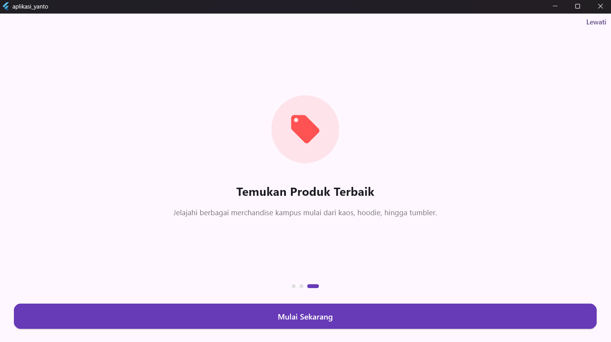
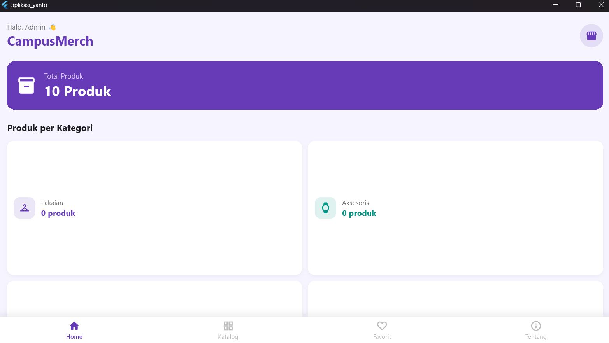
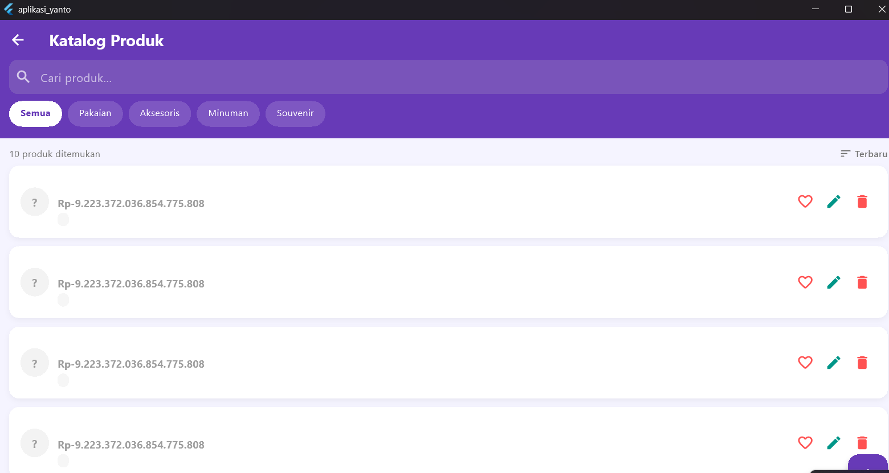

# projek-mobile-programing-yanto
Aplikasi katalog merchandise kampus digital berbasis Flutter &amp; Isar Database. Fitur: Onboarding, CRUD Produk, Pencarian &amp; Filter Kategori, Favorit, dan Foto Produk. Tugas UAS Mobile Programming D4 Bisnis Digital.

# CampusMerch 🎓

> Aplikasi Katalog Merchandise Kampus Digital

## 👤 Identitas Mahasiswa
| | |
|---|---|
| **Nama** | [la yandi] |
| **NIM** | [BD2303005] |
| **Program Studi** | D4 Bisnis Digital |
| **Mata Kuliah** | Mobile Programming |

---

## 📱 Deskripsi Studi Kasus Bisnis

CampusMerch adalah aplikasi mobile berbasis Flutter yang dirancang untuk
membantu mahasiswa dan organisasi kampus dalam mengelola dan mempromosikan
produk merchandise kampus secara digital. Aplikasi ini mencakup katalog
produk lengkap mulai dari pakaian (kaos, hoodie), aksesoris (tote bag,
gantungan kunci), minuman (tumbler, botol minum), hingga souvenir
(stiker, notebook, lanyard).

---

## 🔧 Teknologi yang Digunakan

- **Framework**: Flutter (Dart)
- **Database**: Isar (Local Database)
- **State Management**: setState
- **Package**: image_picker, path_provider

---

## 🗺️ Alur Aplikasi

### 1. Splash Screen
Saat aplikasi pertama kali dibuka, muncul splash screen dengan logo
CampusMerch selama 2 detik sebelum masuk ke halaman Onboarding.

### 2. Onboarding Pages
Terdiri dari 3 halaman perkenalan yang dapat di-swipe atau klik tombol
"Selanjutnya". Halaman terakhir memiliki tombol "Mulai Sekarang" untuk
masuk ke aplikasi utama.

### 3. Home Page
Halaman utama menampilkan:
- Total produk yang tersedia
- Statistik produk per kategori (Pakaian, Aksesoris, Minuman, Souvenir)
- Menu navigasi (Katalog, Tambah Produk, Kelola Produk, Favorit)
- Daftar semua produk yang bisa di-tap untuk melihat detail

### 4. Katalog Produk
Menampilkan seluruh produk dengan fitur:
- **Search**: Cari produk berdasarkan nama
- **Filter**: Saring produk berdasarkan kategori
- **Sort**: Urutkan by Terbaru, Harga Terendah, Harga Tertinggi, Nama A-Z
- **Badge kategori** berwarna untuk tiap produk

### 5. CRUD Produk
- **Create**: Tambah produk baru (nama, harga, kategori, deskripsi, foto)
- **Read**: Lihat detail produk lengkap
- **Update**: Edit data produk yang sudah ada
- **Delete**: Hapus produk dengan konfirmasi dialog

### 6. Favorit
Halaman khusus menampilkan produk yang ditandai sebagai favorit.
Tombol hati (❤️) tersedia di setiap produk di halaman Katalog.

### 7. Tentang Aplikasi
Informasi tentang aplikasi, pembuat, dan teknologi yang digunakan.

---

## 📸 Screenshots

### Onboarding


### Home Page


### Katalog Produk


### Tambah Produk (CRUD)


### Detail Produk


### Favorit


---

## 🚀 Cara Menjalankan Aplikasi

1. Clone repositori ini:
```bash
   git clone https://github.com/[USERNAME_GITHUB_KAMU]/aplikasi_yanto.git
```

2. Masuk ke folder project:
```bash
   cd aplikasi_yanto
```

3. Install dependencies:
```bash
   flutter pub get
```

4. Generate Isar schema:
```bash
   dart run build_runner build --delete-conflicting-outputs
```

5. Jalankan aplikasi:
```bash
   flutter run
```

---

## 📁 Struktur Project

```
lib/
├── main.dart
├── database/
│   └── isar_service.dart
├── models/
│   └── product.dart
└── pages/
    ├── main_page.dart
    ├── splash_page.dart
    ├── onboarding_page.dart
    ├── home_page.dart
    ├── product_list_page.dart
    ├── product_detail_page.dart
    ├── add_edit_product_page.dart
    ├── favorite_page.dart
    └── about_page.dart
```
